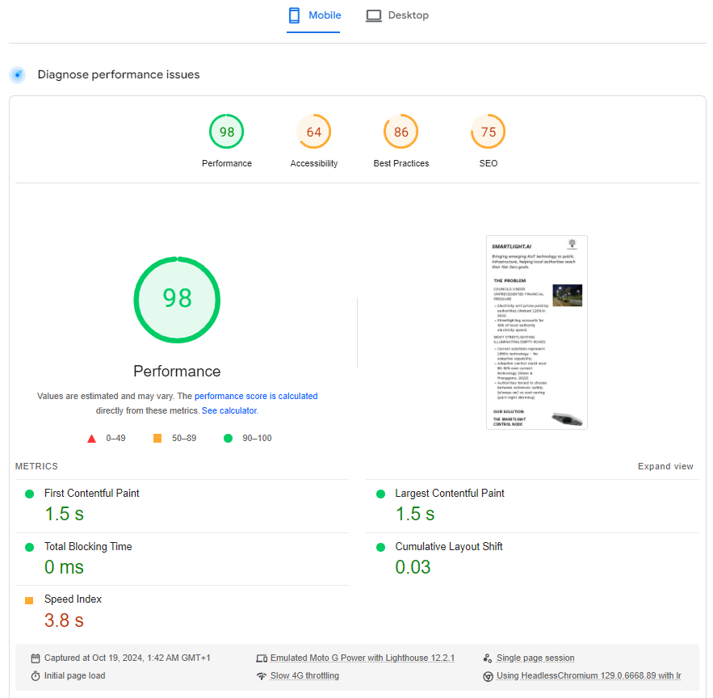
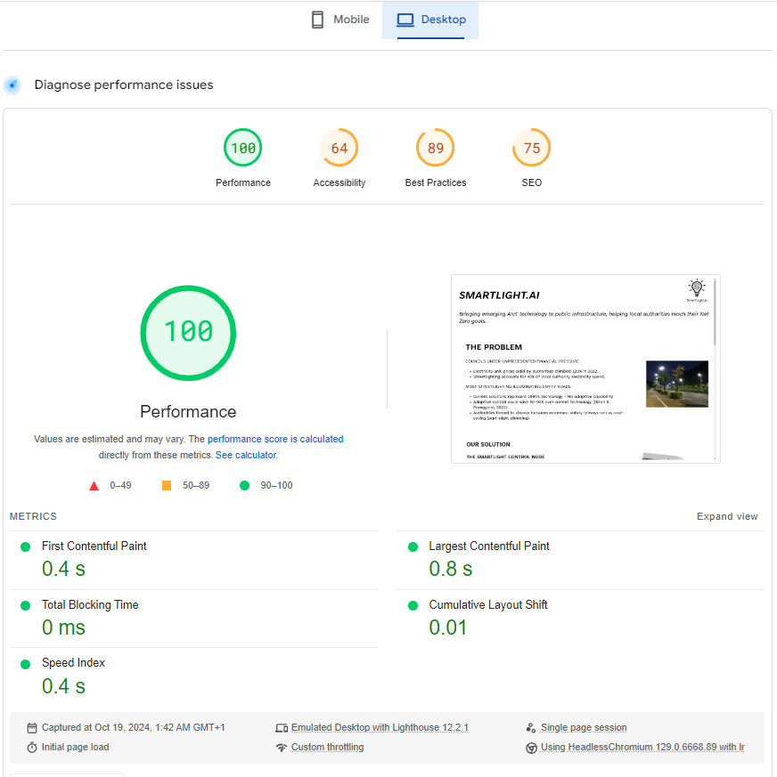

# Redesign of SmartLight.ai's Website: A Case Study
### Why 
For many startups, it is top priority for more time to be allocated to the research and development of the product. As a result of this, this could mean that there is less time spent on other aspects, for instance the website.

First impressions count, especially for startups looking to seek out potential investors. With first point aside from pitching, being the website.

For Sept 2024 mobile devices make up **61.72%** of internet traffic, whilst desktops fall short with **36.29%** *Statcounter (2024)* 

### Objective
- To create an alternative design for the startup's 
- Improve score by 90% for both Mobile and Desktop:
  - Accessability
  - Best Practice
  - SEO 
- Create a premium feel

### Before
Mobile

Desktop

### References 

Score using https://pagespeed.web.dev/

Statcounter (2024). Desktop vs Mobile vs Tablet Market Share Worldwide | StatCounter Global Stats. [online] StatCounter Global Stats. Available at: https://gs.statcounter.com/platform-market-share/desktop-mobile-tablet.

‌